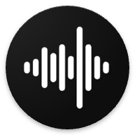

# Alright Voice Recorder

Alright Voice Recorder is a clean, private, and open-source recorder. Customize the look, start recording with one tap from a widget or notification tile, and enjoy zero ads or trackers. Your audio stays yours — always.

## ☕ Support the Project

If you find **Alright Voice Recorder** useful and would like to support its development, consider
buying me a coffee! Your support helps me maintain and improve this project.

*Every contribution, no matter how small, helps keep this project alive and growing! ❤️*   

*Based on [Simple-Voice-Recorder](https://github.com/SimpleMobileTools/Simple-Voice-Recorder), [Fossify Voice-Recorder](https://github.com/FossifyOrg/Voice-Recorder).*
